**Total Time Spent: 64 hours**

---

### Daily Logs

**Day 1 – 03/06/2025**  
*Time Spent:* 5 hours  

Today was the start of the project. I opened my notebook, and began dividing the job of the robot into the simplest behaviors: detecting, acting, and responding. It was apparent that sensors, namely distance sensors (ultrasonic in this case) would be most apt in finding maze walls. As a way of managing motions, I chose a motor driver that would provide better control of speed and direction. I took a few scribbles of early wiring sketches to determine how to connect the microcontroller, sensors, and motors. It became more clear to me by laying out the real simple logical sequence of movement and reactions, which at first seemed overwhelming to be clear about. It is somehow anti-digital to begin with a pen and paper and even before the wires are connected.
 
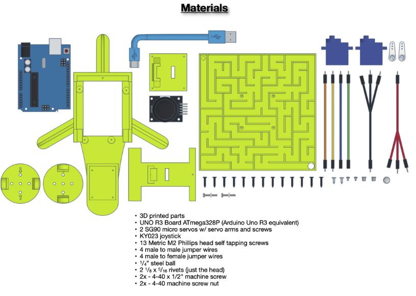

---

**Day 2 – 04/06/2025**  
*Time Spent:* 6 hours  

The day was devoted to the actualisation of those so-called eyes of the robot. I hooked up the ultrasonic sensor, and jumped right into testing it. I created a small dummy maze out of cardboard, narrow enough that the robot would fit through the maze walls and noted how the sensor read distances at various angles. The realization of seeing correct readings coming through went well. I too played around with the angle and the height of the sensor with an intention of a good wall and corner detection. Through numerous trial and error processes, I got its sensor position that would not feel any blind spots.

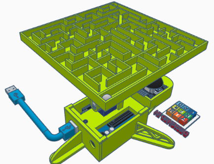

---

**Day 3 – 05/06/2025**  
*Time Spent:* 5 hours  

Motion entered the lists today. I connected the motor driver and the microcontroller and did a preliminary test of both motors. It was an awesome moment when the wheels spun the first time in the hands of the program. By adding a caster wheel at the back end I was able to stabilize the robot when moving which helped some. Due to experimentation of turning mechanisms I began to feel the dynamics of the center of gravity in the robot affecting the balance when getting into sharp route alterations. My wheelbase was very bass reversed, and I experimented a couple of times with reducing wheelbase a little and tests of turning radius so that the movement would be more predictable.

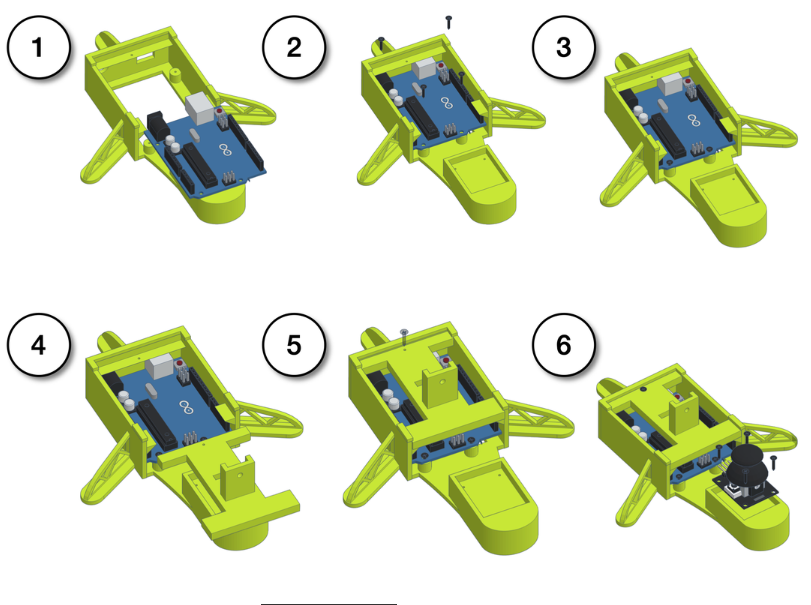

---

**Day 4 – 06/06/2025**  
*Time Spent:* 4 hours  

It was a kind of a detail day. I transplanted the whole circuit into a breadboard, and with great care traced jumper wires to ensure that there was no clutter and to prevent electrical noise or shorts. It also took a little work to make both motors move in perfect synchronicity with each other--I took the time to calibrate the PWM values so that when both motors moved together, it did not drift and instead would move in a straight line. It was a slow process, but to see it move calmly down straight ahead seemed steps in light.

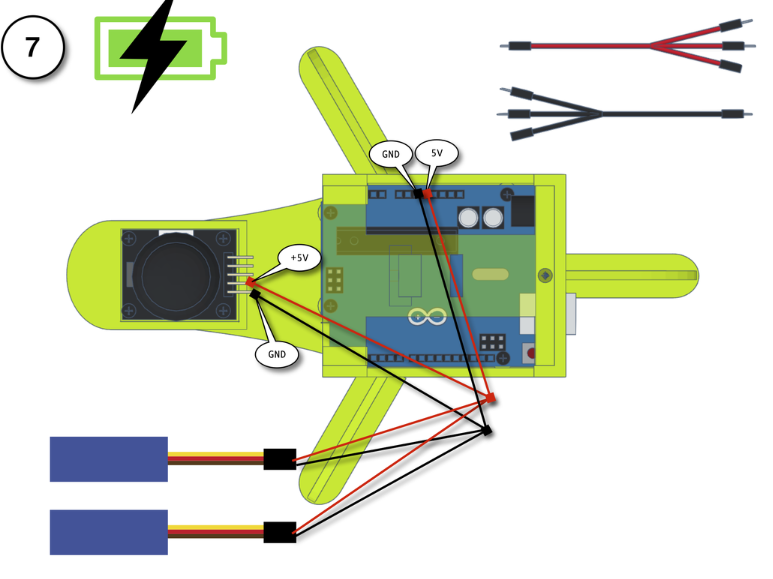

---

**Day 5 – 07/06/2025**  
*Time Spent:* 5 hours  

Already having sensing and movement operational, now it is time to program the logic of the decision-making of the robot. The simple basal behavior was to continue in the direction that one was going as long as the route was clear; otherwise testing was done in other directions. I have then executed a simple solution to the maze program in which the robot turns alternatively left and then right and finally turning back unless it has reached the destination. It was weird to see it make decisions according to the sensor information. One thing is to make a machine and another is to see it making judgement by the logic I coded.

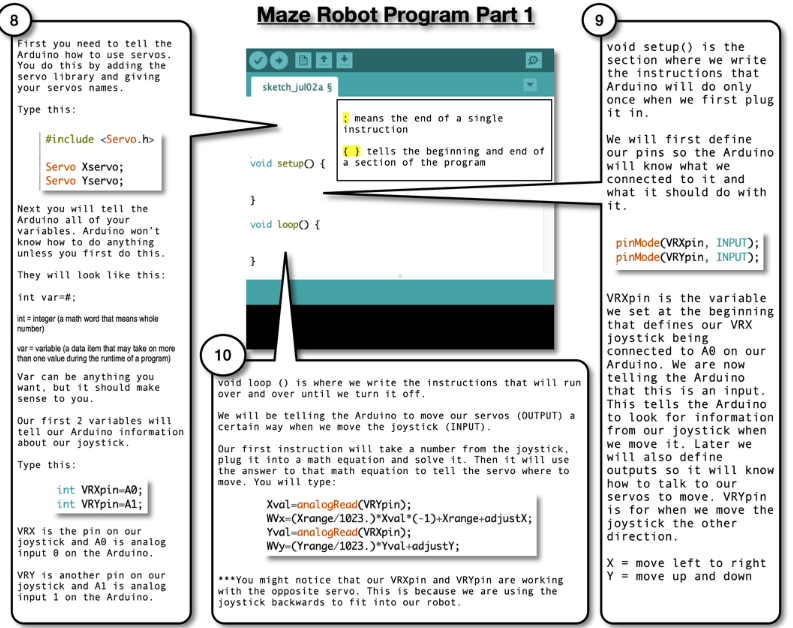

---

**Day 6 – 08/06/2025**  
*Time Spent:* 5 hours  

I equipped the robot with LEDs in order to provide visibility to its behavior. Green is illuminated when it drives forwards, red means stop and blue a turn. They were a doddle to wire up, however, I had flicker problems when they were powered by a voltage drop, uneven supply of power. Some debugging later I replaced some filtering capacitors and cleaned up the power supply routing. Lights now give a crystallized visual tip into what’s thinking and proceeding with the robot.

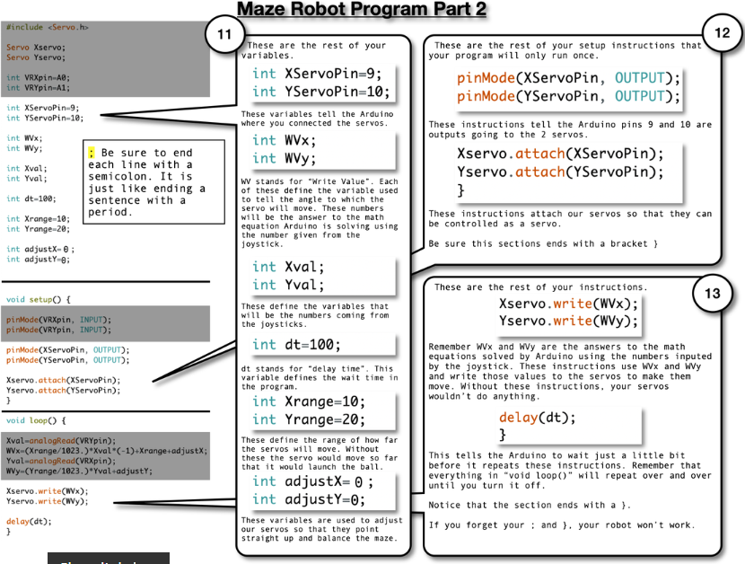

---

**Day 7 – 09/06/2025**  
*Time Spent:* 6 hours  

I tried the robot today, on a more complex addon of the maze maps, with narrower corridors and deliberately placed dead end walls. At first the robot was not doing so well-turns were too sharp, and sensor readings were not being set at the proper time. I also came to the conclusion that I should adjust the polling frequency of the sensor and redefine its detection limits. After I began to optimize the time of the distance checks, the robot began to turn smoother. Logic was also updated and helps to sense dead ends and make more intelligent decisions on how to deal with them.

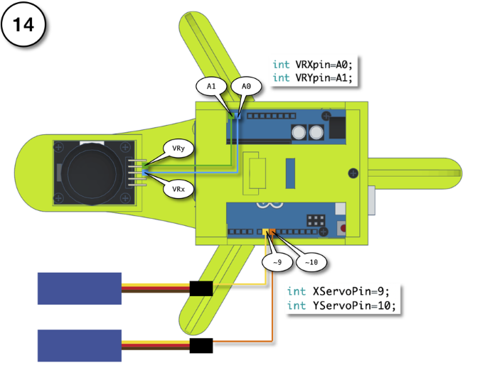

---

**Day 8 – 10/06/2025**  
*Time Spent:* 5 hours  

In the future, I am beginning to incorporate flexibility to future expansions. I added the relay module with the possibility to operate any external devices, such as a light gate or a barrier. I applied synthetic triggers depending on the location of the robot or the input by the robot sensors and conducted tests on how the relay can be triggered in the event that specific conditions are attained. An unexpectedly pleasant event was an audible pat on the back at each time of the relay switching, that is, I managed to lay groundwork of more interactive elements of the maze.

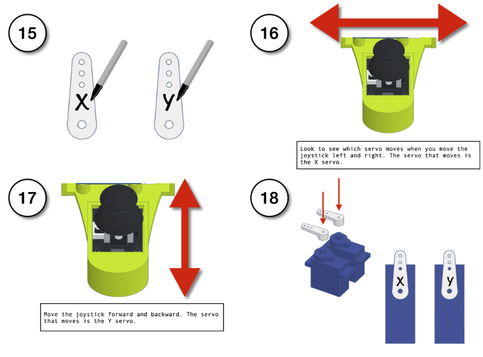

---

**Day 9 – 11/06/2025**  
*Time Spent:* 4 hours  

Today I made some work on giving me some control on the robot as it passed through. I integrated an override with remote simple controller. It would allow me to stop and redirect the robot, or pause it and then resume the robot instead of restarting the entire system. When developing the application, I realized that the receiver could not receive at long distances consequently a certain logic was put in place to handle loss of signal gracefully. The availability of manual control of a machine brought me confidence and provided extra precaution in the experiments.
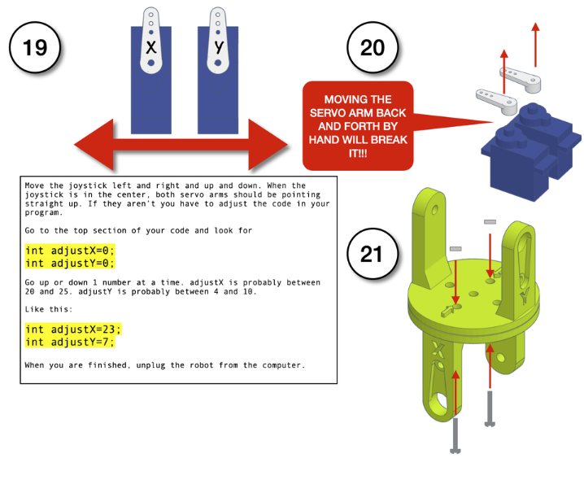

---

**Day 10 – 12/06/2025**  
*Time Spent:* 5 hours  

I went on with interaction by fitting servo motors to serve as barriers or other movable objects. I posted them at maze portals and exits and typed conditions which they would turn. Their testing was done by focusing on the timing of the signals and also to ensure serenity. I found it amusing to watch the robot trip over an obstacle and wait till it clears then move on. Although the simulation was simple, it gave me the idea of how the robot in the future could become more adaptive to the more dynamic surroundings.
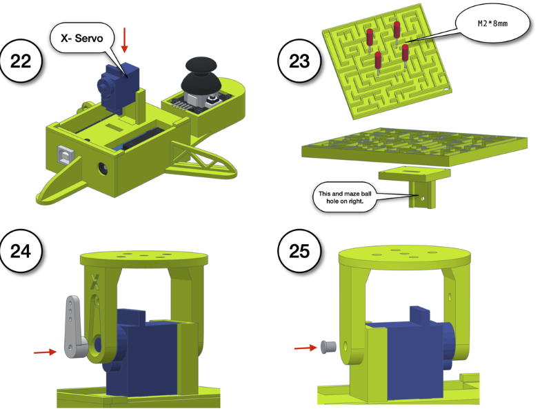

---

**Day 11 – 13/06/2025**  
*Time Spent:* 4 hours  

The majority of features were implemented; I tried to de-clutter all the wiring and optimized the way power is shared. I reeled several parts to add compactness and utilized multimeter readings to maintain the voltage levels to be consistent even when several of them were working. I also checked up what is currently required by modules and ensured that I did not overload any single rail. At the end of the session the entire set-up looked more stable and professional.

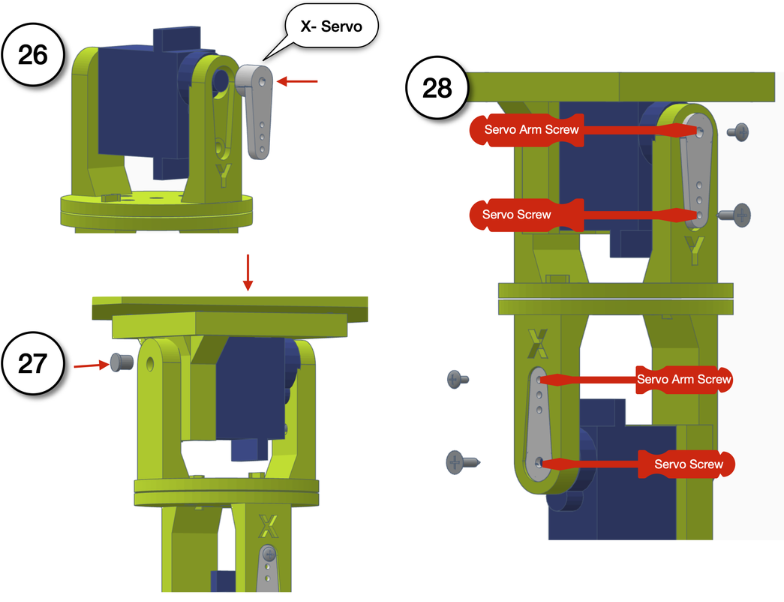

---

**Day 12 – 14/06/2025**  
*Time Spent:* 4 hours  

The last sixth day was a highlight of all earlier. I have assembled the complete maze--with obstacles, LEDs, remote overide, relays and servo interaction--and put the robot through its circuits. It was even better than what I thought it would be. It was able to negotiate turns properly, deal with dead-ends, fire all the external circuitry and it showed its current status by means of the LEDs. Once I have all the wiring diagrams, readme, journal, I was intensely satisfied. This was not a project but a self-discovery of problem solving, iterating and being creative about it.

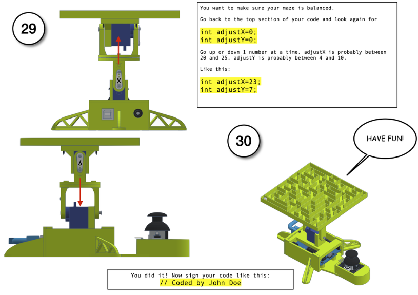

