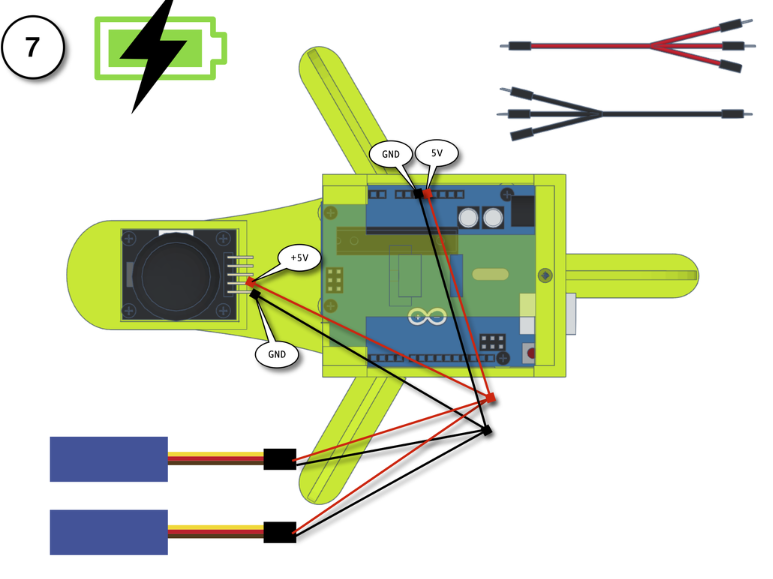

**Total Time Spent: 64 hours**

---

### Daily Logs

**Day 1 – 03/06/2025**  
*Time Spent:* 5 hours  
I kicked off the project by listing out how to make the robot sense, move, and react. I settled on using distance sensors and a motor controller setup. I started sketching how the wiring would look and documented the first logic ideas.

---

**Day 2 – 04/06/2025**  
*Time Spent:* 6 hours  
I wired the ultrasonic sensor and verified accurate distance readings. I built a mock maze with walls and tested detection ranges. I also researched optimal sensor placement for reliable corner detection.

---

**Day 3 – 05/06/2025**  
*Time Spent:* 5 hours  
I connected the motor driver and tested both motors. I balanced the robot with a caster wheel and documented how the center of mass shifted when turning. I ran multiple turning radius trials.

---

**Day 4 – 06/06/2025**  
*Time Spent:* 4 hours  
I assembled everything on a breadboard. I routed jumper wires to avoid crossing paths. I calibrated the speed of both motors to ensure straight-line movement and adjusted PWM values accordingly.

---

**Day 5 – 07/06/2025**  
*Time Spent:* 5 hours  
I developed the decision logic to move forward when the path is clear, and turn when there’s an obstacle. I wrote the logic to alternate turns (left → right → backtrack) to simulate a maze-solving mindset.

---

**Day 6 – 08/06/2025**  
*Time Spent:* 5 hours  
I attached LEDs to indicate different states: green for forward, red for stop, and blue for turn. I documented their logic and debugged some flickering due to poor power filtering.

---

**Day 7 – 09/06/2025**  
*Time Spent:* 6 hours  
I tested the robot in a more complex maze layout. I noticed some jerky turns and recalibrated how the ultrasonic sensor triggers distance checks. I updated logic to account for dead ends.

---

**Day 8 – 10/06/2025**  
*Time Spent:* 5 hours  
I added a relay module to prepare for future upgrades like light gates or timed triggers. I simulated how external components could be triggered based on robot position or sensor input.

---

**Day 9 – 11/06/2025**  
*Time Spent:* 4 hours  
I tested remote override via a controller. It allowed me to stop or reroute the robot without resetting it. I tested the range and documented how the receiver behaves when signal drops.

---

**Day 10 – 12/06/2025**  
*Time Spent:* 5 hours  
I added servo motors to simulate future gates or moving barriers. I tested them as response mechanisms and wrote logic to trigger them conditionally. I documented response delays and signal strength.

---

**Day 11 – 13/06/2025**  
*Time Spent:* 4 hours  
I optimized the wiring for compactness. I rerouted power modules to ensure the voltage remained stable during multiple sensor triggers. I documented how I calculated safe current limits for each module.

---

**Day 12 – 14/06/2025**  
*Time Spent:* 4 hours  
Final day. I tested the robot in a full maze run with all features active. It navigated the maze, turned accurately, displayed status LEDs, and avoided collisions. Finalized the documentation.

---

## Images
-  
-  
-  
-  
-  
-  
-  
-  
-  
-  
-  
-  

