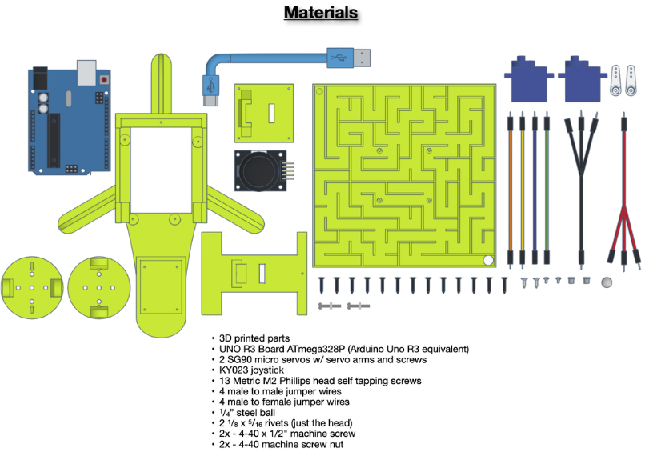
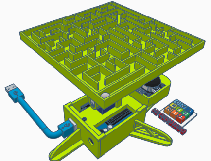

# Electro Robo Maze 

An autonomous mini-robot that explores and solves mazes using ultrasonic sensors, dual motors, and smart decision-making, all built from modular electronics and programmed with logic-based behavior trees.

## Why I Made This Project

I’ve always been fascinated by robots that can think ahead, or at least appear to. So I set out to build a robot that could read its surroundings, decide how to move, and complete mazes on its own. This wasn’t just about movement; it was about decision flow, balance, and making hardware act with purpose.

## Project Images
-  
-  

## Bill of Materials (BOM)

| # | Component                                | Description                                     | Price (USD) | Link |
|---|------------------------------------------|-------------------------------------------------|-------------|------|
| 1 | Raspberry Pi 4B (4GB)                    | Processing unit for extended logic             | $85         | [Link](https://www.ram-e-shop.com/ar/shop/rpi4-board-4gb-raspberry-pi-4b-4gb-8051) |
| 2 | TIMESETL Dual L298N Motor Driver         | Controls DC motor direction and speed          | $12         | — |
| 3 | KKmoon DC Geared Motor with Wheel ×2     | Main drive wheels                              | $12         | — |
| 4 | HC-SR04 Ultrasonic Sensor                | Measures wall distance and detects obstacles   | $14         | — |
| 5 | Caster Wheel                             | Balancing third wheel                          | $12         | — |
| 6 | Battery Pack (Li-ion or 6×AA)            | Provides stable robot power                    | $18         | — |
| 7 | Breadboard + Jumper Wires Kit            | Wiring and prototyping                         | $20         | — |
| 8 | LED Array (3 colors × 10 each)           | Visual status indicators                       | $8          | — |
| 9 | 5 V Dual-channel Relay Module            | Triggers optional peripherals                  | $15         | — |
|10 | High-Quality Power Module                | Regulates power for all sensors                | $9          | — |
|11 | Remote Control + Batteries               | Manual override tool                           | $35         | — |
|12 | 2 High-Torque Servo Motors (40kg·cm)     | Future upgrades and external triggers          | $70         | — |

**Total Cost = $310**

---
